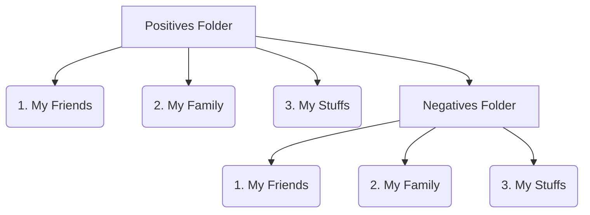

# KmediaOfficer

Media Officer is a Python program designed for maintaining a large amount of multimedia files (**photos, videos, etc.**) organized and controlled. It is focused on two main aspects:

- Arrange and maintain organized all the negatives (raw files from cameras, such as **NEF, CR2, ARW, PEF**, among others).
- Check that all the files have a consistent date plus keeping track of files in risk of loosing its Original or Creation date.

The **source code** can be checked out from the github repository with:
`git clone git://github.com/fjmaro/KmediaOfficer.git`
## How is Media Officer made
Media Officer is based on three sub-modules, RawArranger, Analyxer and Maintainer. Each of these modules have a different purpose:

- **Raw Arranger**: Organization of the RAW files.
- **Files Analyxer**: Find files in risk of loosing original dates, help for firing them and more.
- **Files Maintainer**: Oriented to update the files modification date if their metadata is not compatible.
## What Media Officer needs  
Media officer can run the three aforementioned modules in a row or just the desired one by the user. For the case of running all the modules, the logic under the program is the following:

- **Folders organization**: Media Officer needs to know what is the PATH of three folders:
	- Positives folder: Here is where all your multimedia content is allocated, positives (JPG, PNG, etc.) and negatives (NEF, CR2, etc.)
	- Negatives folder: Here is where you want to store your negatives.
	- Results folder: Here is where the program will store the logs and results of the execution.
> Note: A filter can be included to Media Officer to only analyse the desired folders inside the positive folder
### Multimedia Organization Example

## What is the Media Officer Logic  
Here the steps or logic under each of the three modules are described
- **Raw Arranger**: 
	- **1.** Scans the folders-tree stored in Negatives folder and raises an error if (at least) the same tree is not in the Positives folder. The purpose of this step is to avoid loosing the traceability of the negatives folder (if the folder name has changed and you don't know where is its negative corresponding folder)
	- **2.** Looks for all the negative files in the Positive folder. 
	- **3.** Once found the negatives it will attempt to move them to the negatives folder creating the same folder-tree to reach them in the Positives folder (if it doesn't exist).
	- **4.** If the files to move to negatives doesn't exist will be moved, otherwise an error will be raised indicating that the files already exist in Negatives.
	- **5.** All the folder creation and file movement is logged for user review.
	
- **Analyxer:**
	- **1.** Scan all the positives folder
	- **2.** Rename all the files identified with known naming conventions (IMG_YYYmmdd-HHMMSS, etc.)
	- **3.** Detect any file without a valid KDIN, EKDIN or Metadata Original date (these are treated as files in risk). It also detects corrupted Metadata Original dates.
	- **4.** For all the files with EKDIN (Editing date in file's name) try to write it in the medatada creation date, if not possible add the filename's the KDIN.
	- **5.** Review that for the files with Metadata Original Date and KDIN (Date in the file's name) both dates are the same.
	- **6.** Review that all files with KDIN or Metadata Original Date allocated in a folder with a valid KDIN Bounds that the file-date is inside those bounds
> All these conventions (KDIN, EKDIN, KDINB) are described in kiwutools/basics/conventions.py
> KDIN: Kiwuku date-in-name convention *YYYYmmDD-HHMMSS**
> EKDIN: Edition KDIN *++YYYY-mm-dd+HH-MM-SS++** (this is used for telling the program to include that date in the file metadata and removing this from the filename. If the metadata is not editable then the file will be renamed according to KDIN convention)
> KDIN Bounds: The date bounds described by the folder, there are several accepted cases.
 

